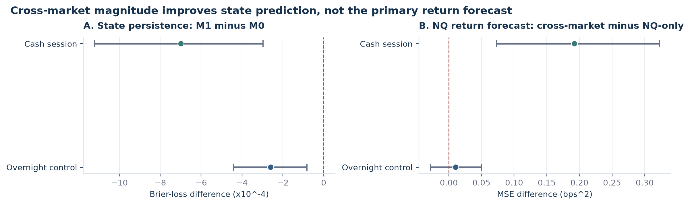
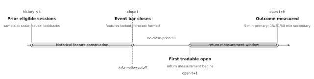

# BTC-NQ Cross-Market Coherence

**Magnitude-conditioned state persistence without incremental NQ return predictability**

[](https://github.com/cliprob/BTC-NQ-Coherence-Research/actions/workflows/ci.yml)
[](https://www.python.org/)
[](docs/PROTOCOL_CLOSURE.md)

## Abstract

This repository studies whether contemporaneous Bitcoin and Nasdaq futures candle-body
agreement defines a persistent cross-market state and whether relative move magnitude
adds economically useful information. BTCUSDT and NQ one-minute bars are synchronized in
UTC, filtered with DST-aware exchange sessions, and evaluated with purged expanding
walk-forward validation.

Joint intensity and magnitude balance produce a small, repeatable improvement in
next-bar state probabilities. They do **not** improve the registered five-minute NQ
return forecast over a matched NQ-only baseline. The evidence supports conditional state
dependence, not tradable alpha.

> **Research status:** completed development study, protocol v1.0.0. The record is locked
> after results for reproducibility. It was not preregistered, and no pristine final
> holdout was opened.

## Main result



Points are paired out-of-fold loss differences; bars are 95% complete-session bootstrap
intervals. Negative values favor the expanded BTC-NQ model.

| Registered comparison | OOF events | Difference | 95% block interval | Interpretation |
|---|---:|---:|---:|---|
| Cash-session state Brier, $M_1-M_0$ | 13,724 | $-0.000699$ | $[-0.001120,-0.000297]$ | Small improvement in state prediction |
| Cash-session return MSE, cross-market $-$ NQ-only | 11,364 | $+0.1924\ \mathrm{bps}^2$ | $[+0.0728,+0.3222]$ | No incremental return value |
| Overnight state Brier, $M_1-M_0$ | 36,230 | $-0.000259$ | $[-0.000440,-0.000081]$ | State result is not cash-session-specific |
| Overnight return MSE, cross-market $-$ NQ-only | 35,804 | $+0.0106\ \mathrm{bps}^2$ | $[-0.0283,+0.0502]$ | Inconclusive; MAE worsens |

The full study is available as a [PDF report](output/pdf/btc_nq_coherence_research.pdf)
and reproducible [LaTeX source](report/manuscript.tex).

## Research design

The analysis separates three questions that are often conflated:

1. **Co-movement:** when do BTC and NQ candle bodies share a direction?
2. **State persistence:** does normalized move magnitude improve the probability that
   agreement continues into the next bar?
3. **Economic value:** do BTC/coherence features improve the executable future NQ return
   forecast over an NQ-only information set?



Features are available only through the event-bar close. Return measurement begins at
the next tradable open; no fill occurs at an already observed close.

## Signal representation

For asset $i\in\{\mathrm{BTC},\mathrm{NQ}\}$, the candle-body return is

$$
b_t^i=\log\left(\frac{C_t^i}{O_t^i}\right),
$$

and per-bar directional agreement is

$$
d_t=\mathrm{sgn}(b_t^{\mathrm{BTC}})
    \mathrm{sgn}(b_t^{\mathrm{NQ}})\in\{-1,0,+1\}.
$$

Directional coherence is kept separate from magnitude:

$$
\mathcal C_t(K)=\frac{1}{n_K}\sum_{j=0}^{n_K-1}d_{t-j},
\qquad K\in\{15,30,60\}\text{ minutes}.
$$

Each absolute body is divided by a causal same-slot MAD estimated from the previous 63
eligible sessions. With normalized magnitudes $m_t^{\mathrm{BTC}}$ and
$m_t^{\mathrm{NQ}}$,

$$
J_t=\sqrt{m_t^{\mathrm{BTC}}m_t^{\mathrm{NQ}}},
\qquad
B_t=\frac{m_t^{\mathrm{BTC}}-m_t^{\mathrm{NQ}}}
          {m_t^{\mathrm{BTC}}+m_t^{\mathrm{NQ}}}.
$$

$J_t$ measures common move intensity; $B_t\in[-1,1]$ measures relative body strength.
Neither variable imposes a lead-lag or catch-up direction.

## Registered comparisons

### State persistence

Conditional on current same-direction bodies,

$$
M_0:\Pr(d_{t+1}=+1\mid\mathbf C_t,S_t),
$$

$$
M_1:\Pr(d_{t+1}=+1\mid\mathbf C_t,S_t,J_t,B_t,|B_t|).
$$

Both models are logistic regressions. The primary score is Brier loss; log loss and
reliability diagrams are secondary diagnostics.

### Incremental NQ return value

The primary economic outcome is the signed NQ open-to-open return over the subsequent
five minutes:

$$
Y_{t,5}=S_t\log\left(\frac{O^{\mathrm{NQ}}_{\tau_t+5m}}
                              {O^{\mathrm{NQ}}_{\tau_t}}\right).
$$

A Ridge model using NQ-only momentum, magnitude, time-of-day, and weekday variables is
compared with an otherwise identical model expanded by BTC momentum, coherence, joint
intensity, and magnitude balance.

## Validation architecture

| Component | Specification |
|---|---|
| Primary representation | 5-minute bars |
| Mandatory robustness | 1-minute bars, same five-minute economic endpoint |
| Coherence clocks | 15/30/60 minutes, used jointly |
| Historical scale | 63 prior eligible same-slot sessions |
| Outer walk-forward | 130 initial training sessions; 12 validation blocks of 22 sessions |
| Purge | One complete session before each validation block |
| Inner selection | Three purged expanding validation blocks |
| State uncertainty | 5,000 paired complete-session bootstrap resamples |
| Negative control | NQ overnight session, evaluated separately |

Scalers and regularization are fitted inside the relevant training fold. Trial ledgers
retain every nested model-selection attempt. Secondary horizons cannot replace the
five-minute primary after outcomes are observed.

## Data scope

- **BTC:** Binance BTCUSDT perpetual, one-minute OHLCV.
- **NQ:** local stitched front-month CME/Nasdaq futures series, one-minute OHLCV.
- **Common range:** 7 March 2024 to 12 May 2026.
- **Primary session:** 09:30-16:00 `America/New_York`, including official early closes.
- **Overnight control:** 18:00-09:30 New York time, excluding the CME maintenance break.

Raw market data are not committed. The repository includes source hashes, schemas,
session-eligibility diagnostics, deterministic derived artifacts, and synthetic test
fixtures. Proprietary NQ observations remain local. See [data access and
provenance](data/README.md).

## Reproduction

```bash
python -m venv .venv
python -m pip install -e ".[dev,report]"
python -m btc_nq_coherence.protocol configs/research_protocol.yaml
pytest
python report/build_report.py --check
```

To rebuild the report, use MiKTeX or TeX Live with `pdflatex`, then run:

```bash
python report/build_report.py
```

The builder regenerates figures from committed aggregate JSON/CSV artifacts, compiles
`report/manuscript.tex`, and writes SHA-256 hashes to `report/report_manifest.json`.

## Repository map

```text
configs/                  frozen research specifications
data/                     schemas, registry, hashes, and local-data instructions
docs/                     protocol, validation notes, provenance, and decision log
reports/development/      compact model outputs and complete trial ledgers
report/manuscript.tex     LaTeX research report
report/figures/           deterministic publication figures
output/pdf/               compiled report
src/btc_nq_coherence/     research implementation
tests/                    unit, integration, and artifact-integrity tests
```

## Interpretation boundaries

This project demonstrates causal feature construction, futures-session handling,
fold-local model selection, calibration, block-bootstrap inference, and separation of
state predictability from return predictability. It does **not** claim:

- that contemporaneous BTC-NQ correlation is alpha;
- that spot Bitcoin ETPs caused the observed relationship;
- that the parameters are economically optimal;
- that NQ price behavior establishes MNQ execution quality;
- that the current sample is a confirmatory holdout or live-trading validation.

## Research record

- [Paper](output/pdf/btc_nq_coherence_research.pdf)
- [Research protocol](docs/RESEARCH_PROTOCOL.md)
- [Protocol closure](docs/PROTOCOL_CLOSURE.md)
- [State-model validation](docs/STATE_MODEL_VALIDATION.md)
- [Return-model validation](docs/RETURN_MODEL_VALIDATION.md)
- [Overnight negative control](docs/OVERNIGHT_NEGATIVE_CONTROL.md)
- [Decision log](docs/DECISIONS.md)

The research question originated in earlier collaborative coursework with
[@AlexSamuseva](https://github.com/AlexSamuseva). This repository is a clean redesign;
legacy notebook results are not treated as evidence. No license has been selected pending
a joint authorship decision.
